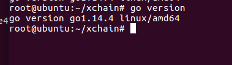

# 环境准备

## Rust智能合约开发环境

接入雄安应用系统前，应先具有Rust智能合约安装环境，具体步骤如下所示：

- 按照官方安装Go环境，本教程推荐使用1.14.4版本。安装好后，在命令行输入`go version`验证版本:

    

    如上图所示， golang1.14.4版本运行环境已经安装成功

- 安装r ustup。rustup是rust的安装和管理工具，在本项目中rustup用来维护依赖和处理cargo、rustc的版本更新，安装脚本：

  ```
  curl --proto '=https' --tlsv1.2 -sSf https://sh.rustup.rs | sh
  rustup default stable
  ```

- 刷新环境变量：

  ```
  source $HOME/.cargo/env
  ```

- 安装后，通过`cargo version`命令获取cargo版本，如下图：

    

- 运行版本低于1.44.1，用下面命令更新：

    ```
    rust update stable
    ```

    

- rust安装成功后，通过下面命令，确认安装了wasm32 target：

    ```
    rustup target list --installed
    ```

    

- 如果显示并没有安装wasm 32，执行以下命令进行安装：

    ```
    rustup target add wasm32-unknow-unknow
    ```

- 再次执行`rustup target list –installed`查看是否安装成功

- 选择开发智能合约的ide，使用vscode安装rust插件或idea安装intellij-rust和intellij-toml以便更好的开发智能合约：intellij-rust是Rust语言插件，intellij-toml是为Toml语言的插件。本教程以Intellij IDEA为例：   
    1. 安装Intellij IDEA，可以根据自己的需要选择商业版或免费版。
    2. 安装开发智能合约需要的两个插件Rust和Toml。安装方式：`Perferences.. ->Plugins` 在Marketplact中直接搜索Rust和Toml并安装即可

- 合约开发参考Demo完成

## 接入环境

- 将xccli文件所在目录加入path环境变量
- 通过xccli生成一个组织管理员密钥和地址
- 命令行输入`xccli keys add <管理员账号名>`，如输入`xccli keys add
admin`，则生成名为admin的管理员，输入命令后命令行信息如下文所示：

    ```
    {
    "name": "admin",
    "type": "local",
    "address": "cosmos1u2aqzefhj37e7k9akercv80gfxauwjayk77gez",
    "pubkey":
    "cosmospub1addwnpepqfn7s74hhmyqkqj09xvvttuezp6qe8d27yxa3fksn3emfenczr6acmq2v59",
    "mnemonic": "all cage select bench blanket chapter capable artefact other
    alone toss ghost need fall dinner rapid rather control budget alpha solid
    dial name special"
    }
    ```

    其中`name`为管理员账户的名字，`type`为管理原账户的类型，`mnemonic`为管理员的私钥的助记符，`pubkey`为管理员账户的公钥，`address`为管理员账户的地址。

    在命令行中输入`xccli status`，获取 *网络名称*、*channel*、*rpc_address*等信息。

    

- 把以上信息发送至网络管理员
