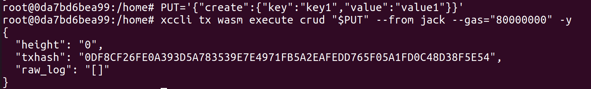
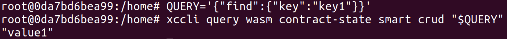
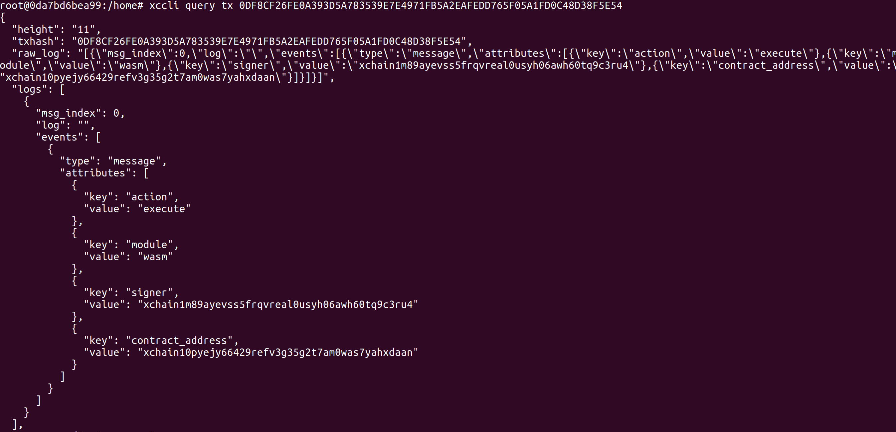

# 智能合约调用

## Rust合约

- 命令行调用Rust合约事务方法

    ```
    PUT='{"合约方法名":{合约参数}}'
    xccli tx wasm execute [合约名字] "$PUT" --from [账户名字] --gas="80000000" -y --node [节点地址] --chain-id=xachain
    ```

    命令行调用Rust合约事务方法的具体样例：   
    ```
    PUT='{"create":{"key":"key1","value":"value1"}}'
    xccli tx wasm execute crud "$PUT" --from jack --gas="80000000" -y
    ```   
    

- 命令行调用Rust合约查询方法

    ```
    QUERY='{"查询方法名":{查询参数}}'
    xccli query wasm contract-state smart [合约名字] "$QUERY" --node [节点地址] --chain-id=xachain
    ```

    命令行调用合约查询方法的具体样例：   
    ```
    QUERY='{"find":{"key":"key1"}}'
    xccli query wasm contract-state smart crud "$QUERY"
    ```
    

## Go合约

- 命令行调用Go合约事务方法

    ```
    PUT='{"method":"合约方法名","value":["{合约参数}"]}'
    xccli tx wasm execute [合约名字] "$PUT" --from [账户名字] --gas="80000000" -y --node [节点地址] --chain-id=xachain
    ```

  命令行调用Go合约事务方法的具体样例：
    ```
    PUT='{"method":"PutStudent","value":["{\"id\":\"1\",\"name\":\"lzh\",\"age\":20,\"score\":80}"]}'
    xccli tx wasm execute student "$PUT" --from jack --gas="80000000" -y
    ```


- 命令行调用Go合约查询方法

    ```
    QUERY='{"method":"查询方法名","value":["key"]}'
    xccli query wasm contract-state smart [合约名字] "$QUERY" --node [节点地址] --chain-id=xachain
    ```

  命令行调用Go合约查询方法的具体样例：
    ```
    QUERY='{"method":"GetStudent","value":["1"]}'
    xccli query wasm contract-state smart student "$QUERY"
    ```

# 查询交易状态

- 查询交易状态代码如下：

    ```
    xccli query tx txhash
    ```

    样例说明图如下所示：   
    

- SDK调用合约方法见Demo