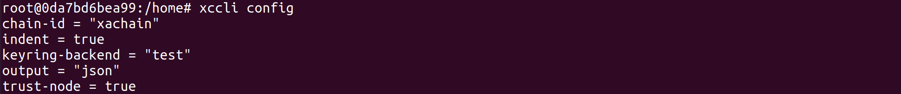
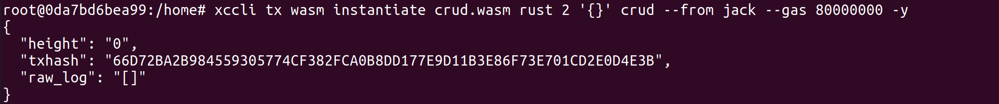

# 智能合约部署和升级

- 合约部署

    部署合约的代码格式如下所示：
  
    ```
    xccli tx wasm instantiate [合约文件] [合约语言] [policy] '初始化参数' [合约名字] --execute-perm [contract execute permission] --from [用户名字] --gas="80000000" -y --node [节点地址] --chain-id=xachain
    ```
    具体的节点地址上文已经说明，可以通过xccli status进行查询

    查看本地用户名和公钥命令如下所示：

    ```
    xccli keys list 
    ```

    查看chain-id的代码如下所示：

    ```
    xccli config
    ```

    

    policy:
  
    1/ACCEPT 2/DROP，合约调用权限的白名单或黑名单模式。
    组织表达式支持精确匹配和模糊匹配，精确匹配形如org1.dep1.group1，模糊匹配支持*、**通配符，*代表该层级的任意组织名，**匹配任意深度的组织名。**匹配任意Level组织。
    
    示例:
    ```
    xccli tx wasm intantiate crud.wasm rust 1 '{}' crud --execute-perm "org1&member" --from jack --gas="80000000" -y
    ```
    组织org1下的所有成员均可调用。
    ```
    xccli tx wasm intantiate crud.wasm golang 2 '{}' crud --from jack --gas="80000000" -y
    ```
    
    所有用户均可调用。

    合约部署的具体样例：   
    ```
    xccli tx wasm instantiate crud.wasm rust 2 '{}' crud --from jack --gas 80000000 -y
    ```
    
    

- 合约升级

    升级合约的代码格式如下所示：

    ```
    xccli tx wasm migrate [合约名字] [合约文件] [policy] '升级参数' --execute-perm [contract execute permission] --from [用户名字] --gas="80000000" -y --node [节点地址] --chain-id=xachain
    ```

    示例:
    ```
    xccli tx wasm migrate crud crud1.wasm 2 '{}' --from jack --gas="80000000" -y
    ```