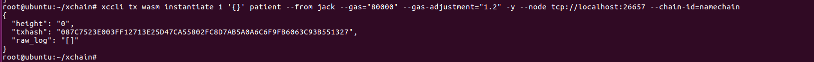

# 智能合约部署

- 合约上传

    上传合约的代码格式如下所示：

    ```
    xccli tx wasm store <合约文件> rust 2 --label <合约标记> --from <账户名> -y --node <节点地址> --chain-id=xchain
    ```

    具体的节点地址上文已经说明，可以通过xccli status进行查询

    查看本地用户名和公钥命令如下所示：

    ```
    xccli keys list 
    ```

    查看chian-id的代码如下所示：
    
    ```
    xccli config
    ```

    

    上传合约的具体样例：   
    ```
    xccli tx wasm store patient.wasm rust 2 --label patient_v1 --from jack -y --node tcp://localhost:26657 --chain-id=namechain
    ```
    

- 合约id获取

    合约上传成功后，通过下面命令获取到刚上传合约的id：

    ```
    xccli query wasm list-code --node <节点地址>
    ```

    合约id获取的具体样例：   
    ```
    xccli query wasm list-code --node tcp://localhost:26657
    ```
    

- 合约安装、初始化

    ```
    xccli tx wasm instantiate <合约id> '初始化参数' <合约名字> --from <账户名> -y --node <节点地址> --chain-id=xchain
    ```

    合约安装、初始化的具体样例：   
    ```
    xccli tx wasm instantiate 8 '{}' patient --from jack -y --node tcp://localhost:26657 --chain-id=namechain
    ```
    