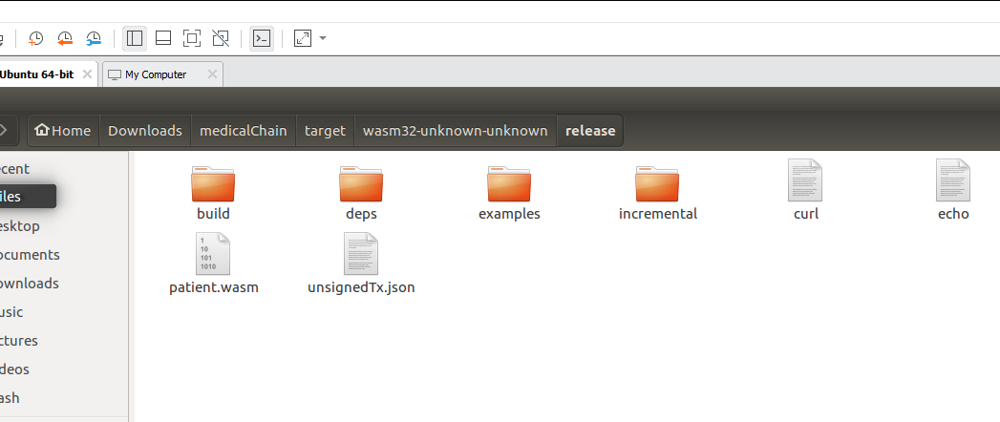

# 智能合约开发

- 基于合约Demo，进行Rust语言开发，Demo为IDEA的Rust工程
- 合约编译：`RUSTFLAGS='-C link-arg=-s' cargo build --release --target wasm32-unknown-unknown`

  根据网络情况稍等一段时间后，合约编译完成结果如下所示：

  

  如果合约编译非常慢，需要更换cargo 依赖源：

  1. 进入`.cargo`目录，默认在当前用户目录下.
  2. 创建一个`config`文件，写入以下内容：
     ```
     [source.crates-io]
     registry = "https://github.com/rust-lang/crates.io-index"
     replace-with = 'ustc'
     [source.ustc]
     registry = "git://mirrors.ustc.edu.cn/crates.io-index"
     ```
- 删除`.package-cache`文件

- 编译完毕的合约，默认在`target/wasm32-unknown-unknown/release`目录下，扩展名`wasm`

    
