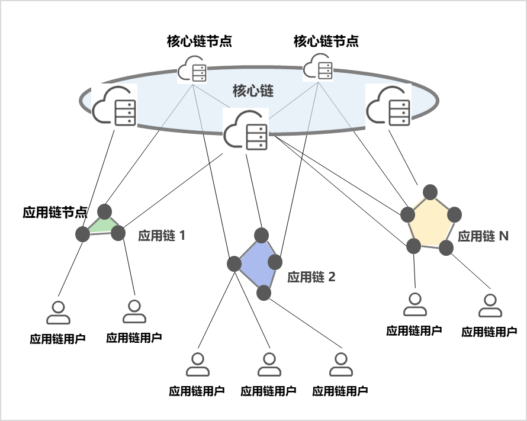

# 架构

&emsp;&emsp;区块链底层基础平台采用“分层多链”总体架构设计，如下图所示。“分层”是指区块链底层基础平台分为核心链和应用链两个层次，“多链”是指区块链底层基础平台能够容纳多条应用链并存，并且支持多条应用链接入核心链，即“1+N”结构。若跟通信网络结构进行类比的话，应用链相当于通信网络中的“接入网”，核心链相当于通信网络中的“核心网”概念。

## 应用链
&emsp;&emsp;应用链可以认为是一条具体的联盟链，应用链专门为特定应用场景建立，针对某项业务或者多个机构组建的应用联盟服务。应用链可以按照具体应用需求进行个性化定制（例如共识算法、智能合约语言等）。每条应用链具备独立完整账本（保持数据隔离性），应用链与应用链之间相互隔离通常不发生业务关系（跨链业务除外）。应用链具备独立的运营与治理能力，应用链内部的用户、应用链节点、智能合约部署、应用场景开发等，由应用链运营机构进行管理。

## 核心链
&emsp;&emsp;核心链是一条具备特定功能的联盟链，由城市级区块链基础设施运营机构负责建设和运营。核心链连接了多条应用链，并负责完成应用链的管理和注册，负责应用链之上的全局共识，以及应用链之间安全的消息传递，完成应用链与应用链之间的跨链服务功能。核心链不存储应用链内部数据，只存储应用链管理维护、跨链交易等相关的数据。