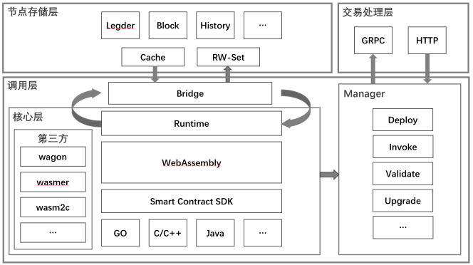

# 智能合约

&emsp;&emsp;雄安区块链底层平台智能合约系统采用基于WASM的虚拟机方式实现，具备独立性、图灵完备、多语言支持、灵活扩展等特性，其与区块链的整体架构分层如下图所示：

* 核心层：智能合约核心逻辑实现，提供WASM第三方工具处理、多语言SDK支持、虚拟机运行环境系统方法、合约的编译、实例化、运行等核心生命周期方法等；
* 调用层：作为智能合约与节点通讯的入口，主要分为Manager和Bridge两个部分，Manager为节点提供智能合约全生命周期管理入口；Bridge则作为智能合约与节点通讯的实现，包括wasm虚拟机与节点、wasm虚拟机与账本或存储层等；
* 节点存储层：实现区块链数据存储缓存机制，统一处理智能合约读写集与世界账本和区块、交易数据相关；
* 交易处理层：区块链接入层负责交易转换、签名、验证并通过参数与合约调用层进行通讯实现智能合约的全生命周期控制；