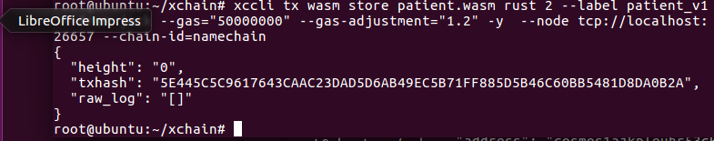
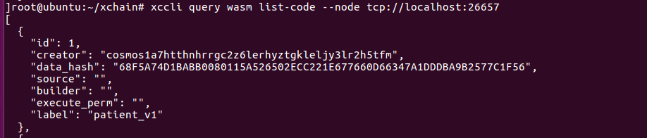
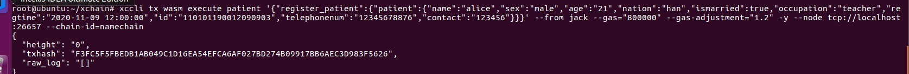

# 智能合约

- 合约开发

  基于合约Demo，进行rust语言合约开发，Demo为idea的rust工程。

  合约编译：

  ```
  RUSTFLAGS='-C link-arg=-s' cargo wasm
  ```

  根据网络情况稍等一段时间后，合约编译完成结果如下所示:

  

  删除.package-cache文件

  编译完毕的合约，默认在target/wasm32-unknown-unknown/release目录下，扩展名wasm

- 合约部署

  上传合约的代码格式如下所示：

  ```
  xccli tx wasm store \<合约文件\> rust 2 --label \<合约标记\> --from
  \<账户名\> -y --node \<节点地址\>
  --chain-id=xchain
  ```

  具体的节点地址上文已经说明，可以通过xccli status进行查询

  查看本地用户名和公钥命令如下所示：

  ```
  xccli keys list
  ```

  查看chain-id的代码如下所示：

  ```
  xccli config
  ```

  

  上传合约的具体样例：

  ```
  xccli tx wasm store patient.wasm rust 2 --label patient_v1 --from jack
   -y --node tcp://localhost:26657
  --chain-id=xchain
  ```

  

  合约上传成功后，通过下面命令获取到刚上传合约的id

  ```
  xccli query wasm list-code --node \<节点地址\>
  ```

  本说明样例：

  ```
  xccli query wasm list-code --node tcp://localhost:26657
  ```

  

  合约安装、初始化

  ```
  xccli tx wasm instantiate \<合约id\> '初始化参数' \<合约名字\> --from
  \<账户名\> -y --node \<节点地址\>
  --chain-id=xchain
  ```

  样例：

  ```
  xccli tx wasm instantiate 8 '{}' patient --from jack -y --node tcp://localhost:26657 --chain-id=namechain
  ```

  

- 合约调用

  命令行调用合约事务方法

  ```
  xccli tx wasm execute \<合约名\> '{"合约方法名":{合约参数}}' --from
  \<账户名\> -y --node \<节点地址\>
  --chain-id=xchain
  ```

  本说明样例：

  ```
  xccli tx wasm execute patient
   '{"register_patient":{"patient":{"name":"alice","sex":"male","age":"21","nation":"han","ismarried":true,"occupation":"teacher","regtime":"2020-11-09
  12:00:00","id":"110101190012090903","telephonenum":"12345678876","contact":"123456"}}}'
  --from jack -y --node
  tcp://localhost:26657 --chain-id=namechain
  ```

  上传结果如下所示：

  

  命令行调用合约查询方法:

  ```
  xccli query wasm contract-state smart \<合约名\>
  '{"查询方法名":{查询参数}}' --node \<节点地址\> --chain-id=xchain
  ```

  样例：

  ```
  xccli query wasm contract-state smart patient
  '{"query_patients":{"precardid":"11010119001209090"}}' --node
  tcp://localhost:26657 --chain-id=namechain
  ```

  

  查询交易状态代码如下：

  ```
  xccli query tx txhash
  ```

  本说明样例如下：

  
