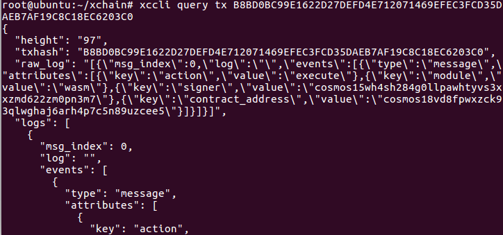

# 智能合约


- 合约开发

  基于合约Demo，进行rust语言合约开发，Demo为idea的rust工程。
  [合约Demo下载](https://github.com/XAbaiyangdian/xchaindoc/blob/master/source/ApplicationAccess/contract/test.zip)

  合约编译：

  ```
  RUSTFLAGS='-C link-arg=-s' cargo build --release --target wasm32-unknown-unknown
  ```

  根据网络情况稍等一段时间后，合约编译完成结果如下所示:

  

  删除.package-cache文件

  编译完毕的合约，默认在target/wasm32-unknown-unknown/release目录下，扩展名wasm

- 合约部署

  命令行部署

  ```
  合约部署详情查看
  xccli tx wasm instantiate -h

  举例
  xccli tx wasm instantiate test.wasm rust 2 "{}" test --from jack --gas="800000" --gas-adjustment="1.2" -y
  ```

- 合约调用

  命令行调用合约事务方法

  ```
  命令说明：
  xccli tx wasm execute -h

  举例：
  PUT='{"create":{"item":{"key":"key1","value":"value1"}}}'
  xccli tx wasm execute test "$PUT" --from jack --gas="800000" -y
  ```

  命令行调用合约查询方法:

  ```
  命令说明：
  xccli query wasm -h

  举例
  QUERY='{"find":{"key":"key1"}}'
  xccli query wasm contract-state smart test "$QUERY"
  ```

  查询交易状态代码如下：

  ```
  xccli query tx txhash
  ```

  本说明样例如下：

  
