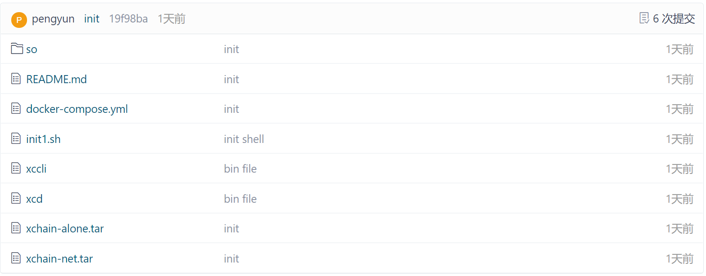

# 前提

下载安装docker软件：

 [https://www.docker.com/get-started](https://www.docker.com/get-started)

  

下载xchain的docker镜像：

 [https://gitee.com/xabl/xchain](https://gitee.com/xabl/xchain)

  

其中xchain-alone.tar为单节点部署xchain的docker镜像，xchain-net.tar为四节点网络部署xchain的docker镜像。
