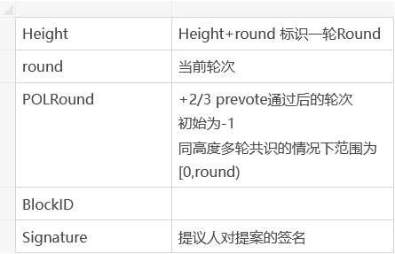
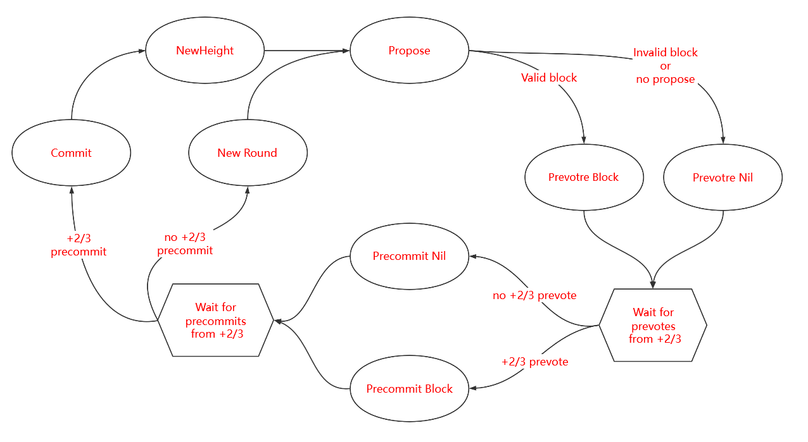
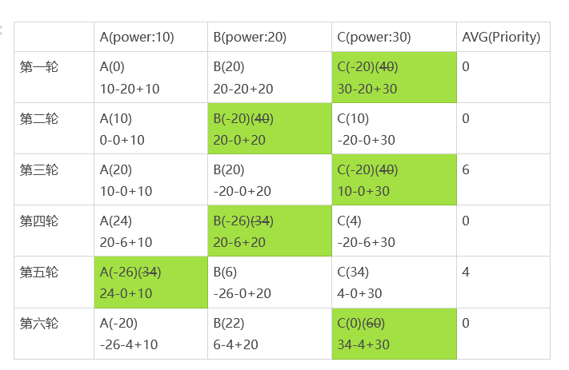
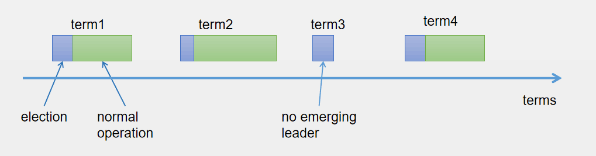
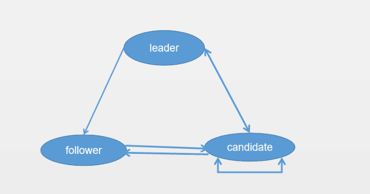

# 共识算法

## 共识算法简介
共识算法是指在分布式场景中，多个节点为了达成相同的数据状态而运行的一种分布式算法。 在分布式场景中，可能出现网络抖动、节点宕机、节点作恶等等故障情况，共识算法需要能够容忍这些错误，
保证多个节点取得相同的数据状态。

根据可容忍的故障类型的不同，可以将共识算法分为两类：
- 故障类容错算法
  
  可以容忍网络抖动、部分节点宕机等非作恶的错误。常见算法有 Paxos、Raft。

- 拜占庭容错算法
  
  可以容忍部分节点任意类型错误，包括节点作恶的情况。常见算法有 PBFT、PoW、PoS等。

根据使用场景的不同，又可将共识算法分为公链共识、联盟链共识两类:
- 公链共识
  
  公链的特点是节点数量多且节点分布分散，主要使用的共识算法有PoW和PoS，这两种共识的优点是可以支持的节点数量多，缺点是TPS较低和交易确认时间长。

- 联盟链共识
  
  联盟链的特点是节点之间网络较为稳定且节点有准入要求，根据需要容忍的错误类型可以选择Raft和PBFT类算法，这类算法的优点是TPS较高且交易可以在毫秒级确认，缺点是支持的验证节点数量有限，通常不多于100个节点。

雄安链共识模块采用插件化的设计，可支持多种共识算法，当前包括PBFT和Raft，后续将会持续实现更大规模，速度更快的共识算法。
##  PBFT
PBFT(Practical Byzantine Fault Tolerance)即实用拜占庭容错算法，PBFT在保证可用性和安全性（liveness & safety）的前提下，提供了(n-1)/3的容错性。

### 为什么PBFT算法的最大容错节点数量是（n-1）/3

PBFT算法除了需要容错故障节点之外，还需要容错作恶节点。假设集群节点数为 N，有问题的节点为 f，有问题的节点中，可以既是故障节点又是作恶节点，或者只是故障节点和只是作恶
节点。那么会产生以下两种极端情况：

- 第一种情况，f 个有问题节点既是故障节点，又是作恶节点，那么根据小数服从多数的原则，集群里正常节点只需要比f个节点再多一个节点，即 f+1 个节点，正常节点的数量就会比故障节点数量多，那么
集群就能达成共识。也就是说这种情况支持的最大容错节点数量是 （n-1）/2。

- 第二种情况，故障节点和作恶节点都是不同的节点。那么就会有 f 个问题节点和 f 个故障节点，当发现节点是问题节点后，会被集群排除在外，剩下 f 个故障节点，那么根据小数服从多数的原则，集群
里正常节点只需要比f个节点再多一个节点，即 f+1 个节点，确节点的数量就会比故障节点数量多，那么集群就能达成共识。所以，所有类型的节点数量加起来就是 f+1 个正确节点，f个故障节点和f个问题
节点，即 3f+1=n。
 
结合上述两种情况，因此 pbft 算法支持的最大容错节点数量是（n-1）/3。

### 雄安链的PBFT实现
雄安链针对传统的PBFT算法做了优化，实现了一个基于Round的协议，协议中使用 `Height` 和初始为0的`round` 来标识一轮Round对一个高度的区块进行共识，当一轮共识不成功时 `round` 自增1进入下一轮Round。 

该基于Round的协议是一个状态机，主要有 NewHeight -> Propose -> Prevote -> Precommit -> Commit 5个状态，上述每个状态都被称为一个Step，首尾的 NewHeight和Commit是两个特殊的Step，中间
的三个循环Steps则被称为一个Round，是共识阶段，也是协议的核心原理所在。一个块的最终提交（Commit）可能需要多个Round过程，这是因为有许多原因可能会导致当前Round不成功（比如出块节点Offline，提出的块
是无效块，收到的Prevote或者Precommit票数不够 +2/3 等）,当一轮Round不成功时便进入下一轮Round并在上一轮的基础上延长timeout时间。

- NewHeight
  
  节点刚启动或者运行到一个新的高度时进入NewHeight阶段。
- Propose
  
  有三种情况会开启Propose阶段:
  - NewHeight阶段Mempool接收到新的交易。
  - NewHeight阶段超时。
  - 一轮Round失败(Precommit阶段未收集到+2/3的投票)后重启一轮Round。
  
  在每一轮Propose开始前会通过round-robin方式选出一个区块提议人来提交这一轮的proposal，如果区块提议人锁定在上一轮的block上（+2/3 Prevote通过的区块，由于某种原因没有被commit），那么区块提议人在本轮中
  发起的proposal会是锁定的Block，在proposal中用`POLRound`标识。提议人创建的区块会被切分成固定大小碎片广播给其他节点。proposal的结构如下:
  
  
  
- Prevote
  
  当节点收到完整的ProposeBlock或者Propose阶段超时后进入Prevote阶段。
  
  在Prevote开始阶段，每个Validator判断自己是否锁定在上一轮的proposed区块上（+2/3 Precommit通过的区块），如果锁定在之前的proposal区块中，那么在本轮中继续为之前锁定的proposal区块签名并
  广播prevote投票,否则为当前轮中接收到的proposal区块签名并广播prevote投票。
  
  如果由于某些原因当前Validator并没有收到任何proposal区块，那么签名并广播一个空的prevote投票。
  
  在Prevote阶段当接收到+2/3 prevote投票后节点锁定当前Round的Block, 对应同高度新一轮Round中Propose阶段的锁定Block。
- Precommit

  Prevote阶段超时或者接收到+2/3 prevote投票后进入Precommit阶段。
  
  在Precommit开始阶段，每个validator判断如果收集到了+2/3 prevote投票，那么为这个区块签名并广播precommit投票，并且将当前Validator会锁定在这个区块上，同时释放之前锁定的区块，在此阶段锁定的Block
  对应于Prevote阶段的 *为之前锁定的proposal区块签名并广播prevote投票*。
  
  如果没有收集到+2/3 prevote投票，那么签名并广播一个空的precommit投票。
  
  处于锁定状态的Validator会为锁定的区块收集prevote投票，并把这些投票打成包放入proof-of-lock中。这里介绍一个重要概念：PoLC(Proof of Lock Change)，表示在某个特定的高度和轮数(height, round)对某个块或 nil (空块)超过总权重 2/3 的Prevote投票集合，简单来说 PoLC 就是 Prevote 的投票集，雄安链中使用锁定Block来预防分叉。
  
  在Precommit阶段后期，如果Validator收集到超过2/3的precommit投票，那么协议进入到Commit阶段，如果待precommit阶段超时后还未收集到超过2/3的precommit投票则协议以当前轮次+1开启一轮新的提案。
- Commit
  
  在整个共识过程的任何阶段，一旦节点收到超过2/3 precommit投票，那么它会立刻进入到commit阶段。在commit阶段节点执行并保存该区块到区块链上，commit结束后协议进入下一个高度的共识进入NewHeight阶段。
  
协议运行如下:


### 如何预防分叉？

假设有-1/3的验证人是拜占庭节点，如果一个验证人在R轮Commit了一个区块B，这表示有 +2/3的验证人在R轮中投了precommits，这意味这有+1/3的诚实验证人会因为PoLC被锁定在R轮，这时候仅剩-2/3的验证人可用于新区块的共识活动，也就不会在同一高度达成一个新的共识区块。

所以雄安链基于BFT共识+锁定区块(PoLC)解决了分叉问题。

### round-robin 验证人选举

每个节点在启动后都会保存一个验证人集合的副本，当区块链每运行到一个新的高度时都会进行一次验证人选举,选举出proposer负责新区块的提议，一般情况下只需要一轮Round就能产生一个区块，遇见网络不好或者validator Offline时可能需要多轮才能出一个块，在对当前高度重新开启一轮区块提议时也会进行一次验证人选举。
节点之间通过遵循一致的算法来保证在每一个高度的每一轮中选举出的提议人一致，在round-robin算法中有两个关键的参数：
- VotingPower
  
  `VotingPower`为验证人在创建时设置的投票权重，投票权重不会随着每一轮优先级的调整变化，但是会参与到优先级的计算调整。
- ProposerPriority
  
  `ProposerPriority`用来标识验证人的优先级，初始`ProposerPriority`与`VotingPower`一致，在一轮选举中优先级最高的验证人为本轮的proposer，在一轮区块提案结束后会重置所有验证人优先级。
  
优先级重置算法描述如下：
   1. 所有验证人的优先级减去平均优先级
   2. 所有验证人的优先级加上各自的VotingPower
   3. 优先级最高的验证人为下一轮提议人
   4. 选中的下一轮提议人的优先级减去总的VotingPower以便在下一轮中计算平均优先级
   
假设由A 、B 、C 三个验证人他们的`VotingPower`分别为10、20、30则6轮验证人选举结果如下图：


可以看出验证人的提议次数与权重成正比，但是避免了一定程度上的提案人连任问题。

### 如何开始PBFT共识？

#### 节点启动时指定共识参数
```shell script
> xcd start --consensus.plugin [solo|pbft|raft|xaplbft]
```
#### 配置文件配置共识参数
```shell script
> vim $HOME/.xcd/config/config.toml
plugin = "pbft"
```

## Raft

Raft是一个允许网络分区的一致性协议，它保证了在一个由N个节点构成的系统中有(N+1)/2（向上取整）个节点正常工作的情况下的系统的一致性，比如在一个5个节点的系统中允许2个节点出现非拜占庭错误，如节点宕机、网络分区、消息延时。

### 为什么raft最大容错节点数量是（n-1）/2 ？
raft 算法只支持容错故障节点，假设集群总节点数为n，故障节点为 f ，根据小数服从多数的原则，集群里正常节点只需要比 f 个节点再多一个节点，即 f+1 个节点，正确节点的数量就会比故障节点数量多，那么集群就能达成共识。因此 raft 算法支持的最大容错节点数量是（n-1）/2。

### 节点类型
Raft每个共识节点只能如下三种身份之一：**Leader**、**Follower**以及**Candidate**，节点由`isLeader`、`isSelected`两个bool型字段来区分共识节点的类型


**leader**:由Follower节点选举而来，在每一次共识过程中有且仅有一个Leader节点，由Leader全权负责从交易池中取出交易、打包交易组成区块并将区块上链；

**follower**:以Leader节点为准进行同步，并在Leader节点失效时举行选举以选出新的Leader节点

**candidate**:Follower节点在竞选Leader时拥有的临时身份。

### 任期
Raft算法将时间划分为不定长度的任期Terms，Terms为连续的数字。每个Term以选举开始，如果选举成功，则由当前leader负责出块，如果选举失败，并没有选举出新的单一Leader，则会开启新的Term，重新开始选举。




### 节点间状态转换
节点类型之间转换关系如下图所示：



leader-->follower:(1)任期结束 （2）转移领导权给一个很活跃的节点

follower-->candidate: 没有接收到领导者“心跳”，投票给自己成为candidate，开始选举

candidate-->follower:在等待选举期间，Candidate收到了其他节点的“心跳”

candidate-->leader:超过一半验证人投票，赢得选举

candidate-->candidate: 选举时间结束后，没有Leader被选出。

### 心跳机制
Raft 的**选主基于一种心跳机制**，leader 会周期性的向所有节点发送心跳`Heartbeat`来维持自己的权威，follower若一段时间内收不到“心跳”就会触发选举（初次启动都默认自己为Follower）。


```
对于leader，tick被设置为HeartbeatTick,HeartbeatTick会递增心跳过期时间计数,只要1次tick时间过去，基本上会发送心跳消息。
```
## 雄安链的RAFT实现
雄安链的raft有两条通道，DataChannel和VoteChannel。

DataChannel用来同步节点间交易(TxsMessage)与区块(BlockMessage)

VoteChannel用来发起投票请求(VoteMessage)和投票响应(VoteResurtMessage)

### 核心流程
**1.选举**

Raft共识模块中使用心跳机制来触发Leader选举。当节点启动时，节点自动成为Follower且将Term置0。只要Follower从Leader或者Candidate收到有效的Heartbeat或投票请求消息，其就会保持在Follower状态，如果Follower在一段时间内（ ***Election Timeout***）没收到上述消息，则它会假设系统当前的Leader已经失活，然后增加自己的Term并转换为Candidiate，开启新一轮的Leader选举流程，流程如下:
1.  Follower增加当前的Term，转换为Candidate；
1.  Candidate将票投给自己，并广播投票请求到其他节点请求投票；
1.  Candidate节点保持在Candidate状态，直到下面情况中的一种发生：

(1)该节点赢得选举；   

(2) 在等待选举期间，Candidate收到了其他节点的Heartbeat；
```
> 如果选举失败，节点间平票等原因导致没有选出leader时：
> 
> xchain为了避免分裂选举的问题,当5轮选举失败时，就会触发随机时间的休眠。休眠一段时间后再进行选举。
```
**2.投票**

1）如果msg类型为VoteMessage，发送给所有Validator（验证节点）：

该节点在这些情况下会拒绝：

- leader还存在并且超时计数不大于选举超时时间
- 消息的Term小于当前状态机维护的Term
- 竞选者的日志没有本地新

除了上述情况，节点都会赞成

2）统计VoteResurtMessage消息，如果赞成超过半数则竞争者变为leader状态，否则变成follower

**3.日志复制**

**什么是日志？**

无论是领导者还是跟随者，都各自保存一个日志副本。首先，每条记录都包括供状态机执行的一条命令，命令的格式可以是客户端与状态所达成一致的某种格式。其次，每条记录都包括一个任期号，这个任期号是该条记录创建时，领导者所处的任期，随着日志记录的增多，这个任期号也会单调上升。

**流程：**
1. 集群某个节点收到client的命令，节点会发送给leader。
2. leader收到消息以后，会处理消息中的日志条目，并将其添加到自己的日志中，广播此日志
3. 各节点以并行的方式执行，返回相应给leader
4. 一旦leader收到足够多的响应，可以它认为该条命令已经在多数节点上处于已提交状态时，那么该条命令就可以被执行。  
5. leader这时会将命令发送给状态机，当执行结束后，它会将结果返回给客户端。

一旦服务器知道某个记录已经处于提交状态，它就会告知其他的服务器。所以最终，每个跟随者都会知道该记录已提交，并且将该命令发送至自己本地的状态机执行。如果跟随者崩溃了或处于慢响应状态，领导者会反复重试这个调用，直到跟随者恢复后，领导者就能重试成功。但是领导者并不需要等待每个跟随者的响应，它只需要等到足够数量的响应，保证记录已被大多数服务器存储即可。

**4.交易出块流程**

Raft协议强依赖Leader节点的可用性来确保集群数据的一致性，因为数据只能从Leader节点向Follower节点转移。

1.当leader选出后，follower快速向leader同步块高度差的数据。

2.当MemPool.TxsAvailable()触发后，触发出块。  

3.leader取出交易池中的交易打包成块

4.进行Precommit投票，当超过二分之一的验证节点赞成时，区块数据状态进入committed状态

5.follower节点根据`blockMessage`保存块


**5. PreVote**

PreVote是解决因为某个因为网络分区而失效的节点重新加入集群以后，会导致集群重新选举的问题。
```
问题出现的过程是这样的，假设当前集群的Term是1，其中一个节点，比如A，它因为网络分区，接收不到
leader的心跳，当超过选举超时时间以后，它会将自己变成Candidate，这时候它会把它的Term值变成2，然后
开始竞选。

当然这时候是不可能竞选成功的。可是当网络修复以后，无论是它的竞选消息，还是其他的回复消息，都会带
上它的Term，也就是2。而这时候整个集群里其他机器的Term还是1，这时候的leader发现已经有比自己Term高
的节点存在，它就自己乖乖降级为follower，这样就会导致一次重新选举。
```
这种现象本身不常见，而且出现了也只是出现一次重选举，对整个集群的影响并不大。但是如果希望避免这种情况发生，就需要PreVote。

**PreVote的做法是：**

当集群中的某个follower发现自己已经在选举超时时间内没收到leader的心跳，不是直接变成candidate，也就不会将Term自增1。而是引入一个新的环境叫PreVote。

1.它会先广播发送一个PreVote消息

2.其他节点如果正常运行，就回复一个反对预选举的消息  
其他节点如果也失去了leader，才会有回复赞成的消息。

3.节点只有收到超过半数的预选举选票，才会将自己变成candidate，发起选举

这样，如果是这个单个节点的网络有问题，它不会贸然自增Term，因此当它重新加入集群时。也不会对现任leader地位有任何冲击。保证了系统更稳定的方式运行。
