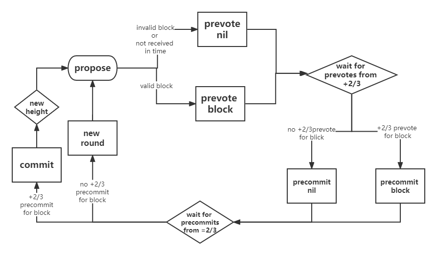
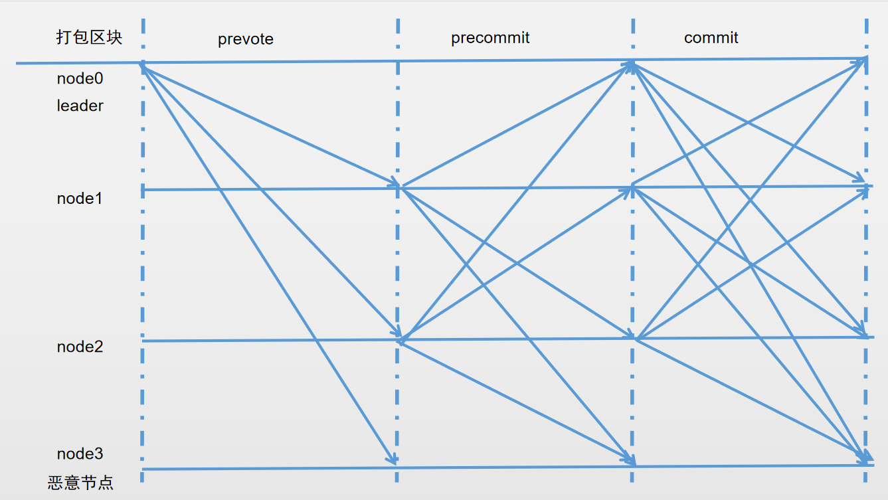
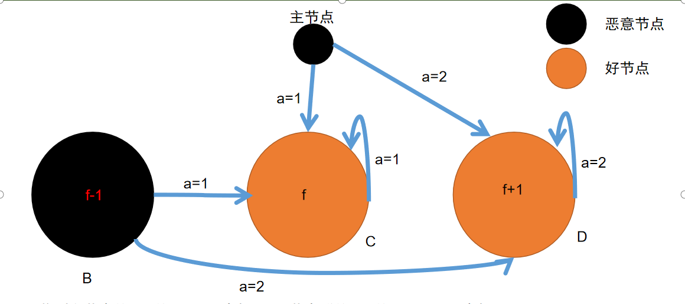
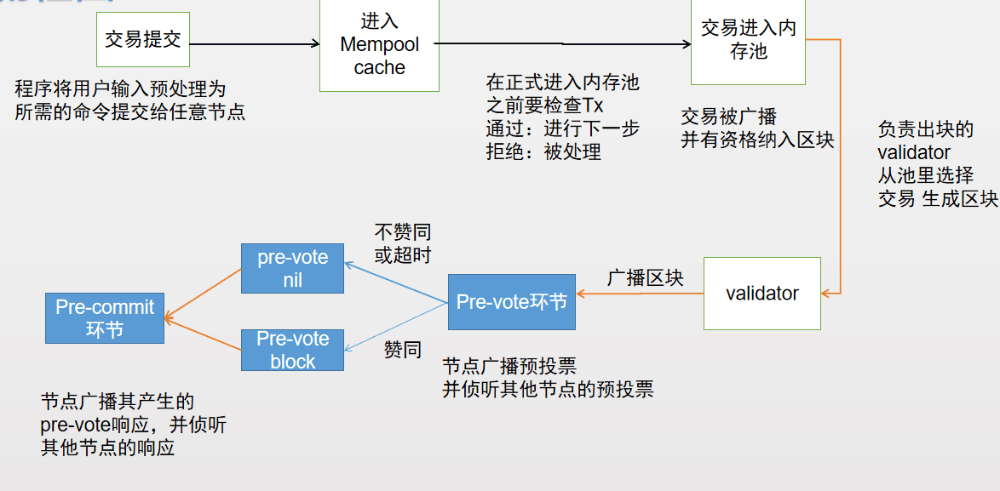
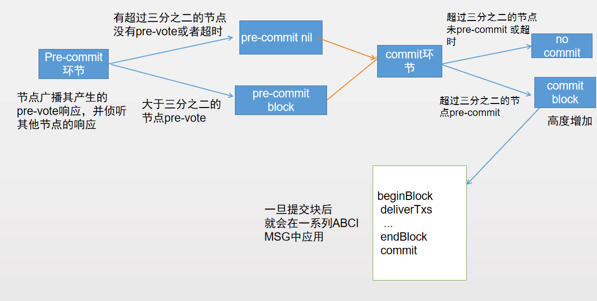
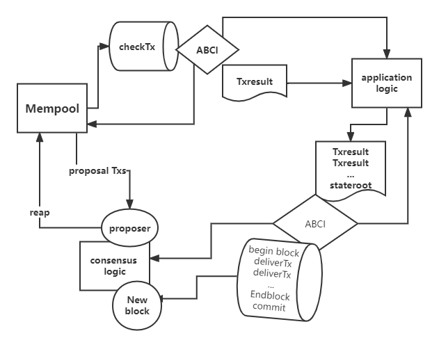
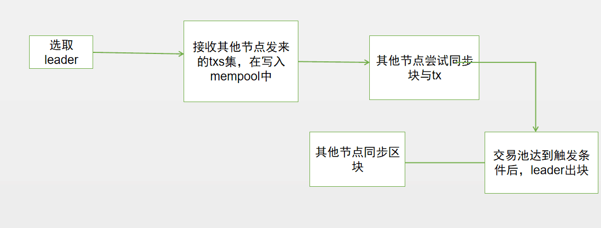

# 共识算法


## 介绍
雄安链采用插件化设计实现，通过修改系统配置，即可以在一个联盟链里使用不同的共识机制，参与到这个联盟链的所有节点必须采用同一种共识配置。xchain改进了主流的联盟链共识算法，采用POA+PBFT和POA+Raft两种共识。
整个过程包括2大阶段：  

验证人选举：通过相关选举规则选出一个验证者集合；
共识出块：验证者集合按照约定的协议规则进行区块生产；

**验证人validator**

验证者负责在区块链中提交新块。这些验证者通过广播 *votes* 参与共识协议，其中包含由每个验证者的私钥签名。
验证者在共识协议中可能具有不同的投票“权重”。xchain并不关注验证者数目的三分之一或三分之二， 而是关注总投票权的比例。而且，这个比例可能不是在各个验证者中均匀分布的。

**如何创建验证者**

有两种方法可以成为验证者。

1.  创世区块创立时预先建立
2. 通过网络管理员发起提案并进行投票  提案生效后通过 `EndBlock`  将应用端验证人的变更响应到共识层(可新增、可删除、可修改权重)


##  PBFT

 **PBFT 共识算法的特性包括：**
 
1.共识节点轮流出块，具有同等的记账权，体现了参与者的对等性，且防止个别记账者作恶

2.秒级出块，可配置为 1 秒到几秒出块，满足交易短时间内响应的需求；

3. 支持 1/3 容错，整个系统中少于等于 1/3 数量的节点出现故障或作恶，均不影响共识进行；

4. 在区块同步的过程中严格校验签名，保证数据的安全性。

**共识逻辑**



+2/3 是 “大于2/3”的缩写，validator轮流提出区块并对其进行投票。 

核心流程如下



一共三个阶段：
pre-vote:
主节点广播投票信息给其他节点，节点收到信息后，检查信息有效性，投票并将结果广播给其他节点，进入下一阶段；若不通过则忽略或拒绝。
pre-commit:
节点收集其他节点广播的结果，并校验有效性，赞成赞成达到三分之二后，再次进行投票并广播，进入下一阶段。
commit:
节点收集其他节点广播的选择，并校验有效性，赞成权重达到三分之二后，进行提交

当一个区块提交失败时，协议将进入到下一**round（轮）** ，新的验证者将为该高度提出一个新的区块。 
```
提交失败的原因：
1.投票阶段赞成权重不足
2.出块节点故障或异常
```

成功提交一个块需要两个阶段的投票，分别是**pre-vote（预投票）** 和**pre-commit（预提交)** 。 当同一轮中预提交同一个区块时，投票超过2/3的权重，区块就会被提交到区块链中。

```
验证者可能由于多种原因未能提交区块： 当前的区块提交者可能离线，或者网络可能拥堵。就会确认跳过这个验证者。
在投票进入下一轮之前，验证者们会等待一小段时间从提交者处收到完整的区块。
```
Q：
**为什么要超过三分之二的权重？**

precommit阶段时：主要是考虑到主节点的作恶问题。

若主节点是诚实的，二分之一就足够了，但若主节点有问题就需要三分之二的权重

举例说明：



假如以二分之一为界限：

C共收到主节点的a=1的prevote消息，和B节点群的a=1的precommit消息，以及自己的a=1的precommit消息，共2f条，满足大于1/2，得出a=1的结论

C共收到主节点的a=2的prevote消息，和B节点群的a=2的precommit消息，以及自己的a=2的precommit消息，共2f+1条，满足大于1/2，得出a=2的结论

事实上，C和D的结论相矛盾，不能达成共识。

commit阶段：commit阶段存在的意义是想要在存在换主的情况下，新的主节点能够把被部分诚实节点已经提交的请求在下一轮重新提起，使得没有提交的诚实节点也会提交，从而保证全局的一致性。

基于该理解，之所以Commit阶段也要求收到大于三分之二个precommit消息，是因为恶意节点可能在当前View中发送了precommit数据，但在View Change的时候故意不发送该precommit数据。

**交易流程图**

  


  
 
**交易的处理逻辑**



>区块的执行逻辑
>
>beginBlock 
>
>deliverTxs 
>
>  ...
>  
>endBlock 
>
>commit

**验证节点间轮值**

poa+pbft的出块节点有一个固定的顺序，验证节点会一直检查是否轮到自己出块了。
```
PBFT是一种状态机副本复制算法，所有的副本在一个视图（view）轮换的过程中操作，
出块节点通过视图编号以及节点数集合来确定，即：出块节点 p = v mod |R|。
v：视图编号，|R|节点个数，p：出块节点编号。
```

## RAFT

**RAFT 共识算法特性包括：**

1.共识节点达到出块条件，即把当前块作为候选区块发起选举，所有共识节点具有同等选票权重，体现了参与者的对等性；

2.候选区块超过半数赞成票才提交到区块链中，保证高一致性；

3.如果超时没有收集超过半数的回复票，则重新发起选举，保证系统的容错恢复能力；

4.秒级出块，可以配置为 1 秒或多秒出块；

5.支持 1/2 节点容错，整个系统中少于 1/2 数量的节点出现故障，均不影响共识进行；

6.在选举过程和区块同步过程中严格校验签名，保证数据的安全性

**交易流程**

leader选举出来后，所有日志都必须首先提交至 leader 节点，leader 将此条目复制给所有的节点。

当大多数节点记录此条目之后，leader 节点认定此条目有效，将此条目设定为已提交并存储于本地磁盘。

leader 通知所有节点提交这一日志条目并存储于各自的磁盘内。

**验证节点间轮值**

leader节点会一直向其他节点发送“心跳”，表明自己还在任期

当节点没有收到leader的心跳时 : 采取验证人节点间竞争的方式

每个validator发起选举然后投票给自己，并向集群其他服务器验证人发送投票请求。有超过1/2的验证人返回同一个leader后确认

当leader超时或不在线时，重新选举leader

