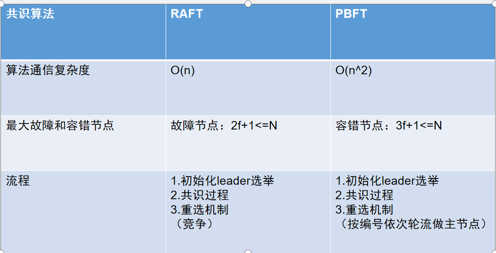

# 共识算法

## 共识算法简介
共识算法是指在分布式场景中，多个节点为了达成相同的数据状态而运行的一种分布式算法。 在分布式场景中，可能出现网络抖动、节点宕机、节点作恶等等故障情况，共识算法需要能够容忍这些错误，
保证多个节点取得相同的数据状态。

根据可容忍的故障类型的不同，可以将共识算法分为两类：
- 故障类容错算法
  
  可以容忍网络抖动、部分节点宕机等非作恶的错误。常见算法有 Paxos、Raft。

- 拜占庭容错算法
  
  可以容忍部分节点任意类型错误，包括节点作恶的情况。常见算法有 PBFT、PoW、PoS等。

根据使用场景的不同，又可将共识算法分为公链共识、联盟链共识两类:
- 公链共识
  
  公链的特点是节点数量多且节点分布分散，主要使用的共识算法有PoW和PoS，这两种共识的优点是可以支持的节点数量多，缺点是TPS较低和交易确认时间长。

- 联盟链共识
  
  联盟链的特点是节点之间网络较为稳定且节点有准入要求，根据需要容忍的错误类型可以选择Raft和PBFT类算法，这类算法的优点是TPS较高且交易可以在毫秒级确认，缺点是支持的验证节点数量有限，通常不多于100个节点。

雄安链共识模块采用插件化的设计，可支持多种共识算法，当前包括PBFT和Raft，后续将会持续实现更大规模，速度更快的共识算法。
##  PBFT
PBFT(Practical Byzantine Fault Tolerance)即实用拜占庭容错算法，PBFT在保证可用性和安全性（liveness & safety）的前提下，提供了(n-1)/3的容错性。

### 为什么PBFT算法的最大容错节点数量是（n-1）/3

PBFT算法除了需要容错故障节点之外，还需要容错作恶节点。假设集群节点数为 N，有问题的节点为 f，有问题的节点中，可以既是故障节点又是作恶节点，或者只是故障节点和只是作恶
节点。那么会产生以下两种极端情况：

- 第一种情况，f 个有问题节点既是故障节点，又是作恶节点，那么根据小数服从多数的原则，集群里正常节点只需要比f个节点再多一个节点，即 f+1 个节点，正常节点的数量就会比故障节点数量多，那么
集群就能达成共识。也就是说这种情况支持的最大容错节点数量是 （n-1）/2。

- 第二种情况，故障节点和作恶节点都是不同的节点。那么就会有 f 个问题节点和 f 个故障节点，当发现节点是问题节点后，会被集群排除在外，剩下 f 个故障节点，那么根据小数服从多数的原则，集群
里正常节点只需要比f个节点再多一个节点，即 f+1 个节点，确节点的数量就会比故障节点数量多，那么集群就能达成共识。所以，所有类型的节点数量加起来就是 f+1 个正确节点，f个故障节点和f个问题
节点，即 3f+1=n。
 
结合上述两种情况，因此 pbft 算法支持的最大容错节点数量是（n-1）/3。

### 雄安链的PBFT实现
雄安链针对传统的PBFT算法做了优化，实现了round-based协议，在链达到一个新的Height时候，系统会运行一个round-based协议来决定下一个block。

round-based协议是一个状态机，主要有 NewHeigh -> Propose -> Prevote -> Precommit -> Commit 5个状态，上述每个状态都被称为一个Step，首尾的 NewHeigh和Commit这两个Steps被称为特殊的 Step，而中间
循环三个Steps则被称为一个 Round，是共识阶段，也是也是算法的核心原理所在。一个块的最终提交（Commit）可能需要多个Round过程，这是因为有许多原因可能会导致当前Round不成功（比如出块节点Offline，提出的块
是无效块，收到的Prevote或者Precommit票数不够 +2/3 等等），出现这些情况的解决方案就是移步到下一轮，或者增加 timeout 时间。

- NewHeight
  
  节点刚启动或者运行到一个新的高度时进入NewHeight阶段。
- Propose
  
  在每一轮开始前会通过round-robin方式选出一个区块提议人，选出的区块提议人会提交这一轮的proposal，如果区块提议人锁定在上一轮中的block上（prevote通过的区块，由于某种原因没有被commit后开启
  的新一轮propose），那么区块提议人在本轮中发起的proposal会是锁定的block，并且在proposal中加上proof-of-lock字段。proposal的结构如下:
  
  |  字段   | 描述  |
  |  ----  | ----  |
  | Height  | 区块高度 |
  | Round  | 当前轮次 |
  | POLRound  |  prevote通过后的轮次 |
  | BlockID  |  区块哈希 |
  | Signature  |  提议人对提案的签名 |
  
- Prevote
  
  在Prevote开始阶段，每个Validator判断自己是否锁定在上一轮的proposed区块上（precommit通过的区块），如果锁定在之前的proposal区块中，那么在本轮中继续为之前锁定的proposal区块签名并
  广播prevote投票,否则为当前轮中接收到的proposal区块签名并广播prevote投票。
  
  如果由于某些原因当前Validator并没有收到任何proposal区块，那么签名并广播一个空的prevote投票。
- Precommit

  在Precommit开始阶段，每个validator判断如果收集到了+2/3 prevote投票，那么为这个区块签名并广播precommit投票，并且将当前Validator会锁定在这个区块上，同时释放之前锁定的区块。
  如果没有收集到+2/3 prevote投票，那么签名并广播一个空的precommit投票。
  
  处于锁定状态的Validator会为锁定的区块收集prevote投票，并把这些投票打成包放入proof-of-lock中，proof-of-lock会在之后的propose阶段用到。这里介绍一个重要概念：PoLC，
  全称为 Proof of Lock Change，表示在某个特定的高度和轮数(height, round)，对某个块或 nil (空块)超过总结点 2/3 的Prevote投票集合，简单来说 PoLC 就是 Prevote 的投票集。
  
  在precommit阶段后期，如果Validator收集到超过2/3的precommit投票，那么协议进入到commit阶段，如果待precommit阶段超时后还未收集到超过2/3的precommit投票则协议以当前轮次+1开启一轮新的提案。
- Commit
  
  在整个共识过程的任何阶段，一旦节点收到超过2/3 precommit投票，那么它会立刻进入到commit阶段。在commit阶段节点执行并保存该区块到区块链上，commit结束后协议进入下一个高度的共识进入NewHeight阶段。
  
协议运行如下:


### round-robin 验证人选举

每个节点在启动后都会保存一个验证人集合的副本，当区块链每运行到一个新的高度时都会进行一次验证人选举,选举出proposer负责新区块的提议，一般情况下只需要一轮(round)就能产生一个区块，遇见网络不好或者当前选举出的proposer不在线时可能需要多轮才能出一个块，在对当前高度重新开启一轮区块提议时也会进行一次验证人选举。
节点之间通过遵循一致的算法来保证在每一个高度的每一轮中选举出的提议人一致，在round-robin算法中有两个关键的参数：
- VotingPower
  
  `VotingPower`为验证人在创建时设置的投票权重，投票权重不会随着每一轮优先级的调整变化，但是会参与到优先级的计算调整。
- ProposerPriority
  
  `ProposerPriority`用来标识验证人的优先级，初始`ProposerPriority`与`VotingPower`一致，在一轮选举中优先级最高的验证人为本轮的proposer，在一轮区块提案结束后会重置所有验证人优先级。
  
优先级重置算法描述如下：
   1. 所有验证人的优先级减去平均优先级
   2. 所有验证人的优先级加上各自的VotingPower
   3. 优先级最高的验证人为下一轮提议人
   4. 选中的下一轮提议人的优先级减去总的VotingPower以便在下一轮中计算平均优先级
   
假设由A 、B 、C 三个验证人他们的`VotingPower`分别为10、20、30则6轮验证人选举结果如下图：

可以看出验证人的提议次数与权重成正比，但是避免了一定程度上的提案人连任问题。

## RAFT

**RAFT 共识算法特性包括：**

1.共识节点达到出块条件，即把当前块作为候选区块发起选举，所有共识节点具有同等选票权重，体现了参与者的对等性；

2.候选区块超过半数赞成票才提交到区块链中，保证高一致性；

3.如果超时没有收集超过半数的回复票，则重新发起选举，保证系统的容错恢复能力；

4.秒级出块，可以配置为 1 秒或多秒出块；

5.支持 1/2 节点容错，整个系统中少于 1/2 数量的节点出现故障，均不影响共识进行；

6.在选举过程和区块同步过程中严格校验签名，保证数据的安全性

**交易流程**

leader选举出来后，所有日志都必须首先提交至 leader 节点，leader 将此条目复制给所有的节点。

当大多数节点记录此条目之后，leader 节点认定此条目有效，将此条目设定为已提交并存储于本地磁盘。

leader 通知所有节点提交这一日志条目并存储于各自的磁盘内。

**验证节点间轮值**

leader节点会一直向其他节点发送“心跳”，表明自己还在任期

当节点没有收到leader的心跳时 : 采取验证人节点间竞争的方式

每个validator发起选举然后投票给自己，并向集群其他服务器验证人发送投票请求。有超过1/2的验证人返回同一个leader后确认

当leader超时或不在线时，重新选举leader

## PBFT与RAFT的区别
1.pbft 算法的最大容错节点数量是(n-1)/3，而 raft 算法的最大容错节点数量是(n-1)/2

2.raft算法的的容错只支持容错故障节点，不支持容错作恶节点。pbft 算法的除了支持容错故障节点之外，还支持容错作恶节点。

```
故障节点: 节点因为系统繁忙、宕机或者网络问题等其它异常情况导致的无响应，出现这种情况的节点就是故障节点
作恶节点：除了可以故意对集群的其它节点的请求无响应之外，还可以故意发送错误的数据，或者给不同的其它节点发送不同的数据，使整个集群的节点最终无法达成共识
```

3.一图说明


