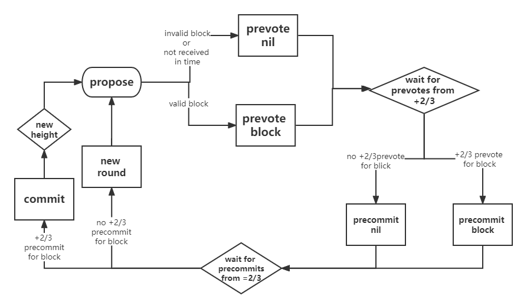
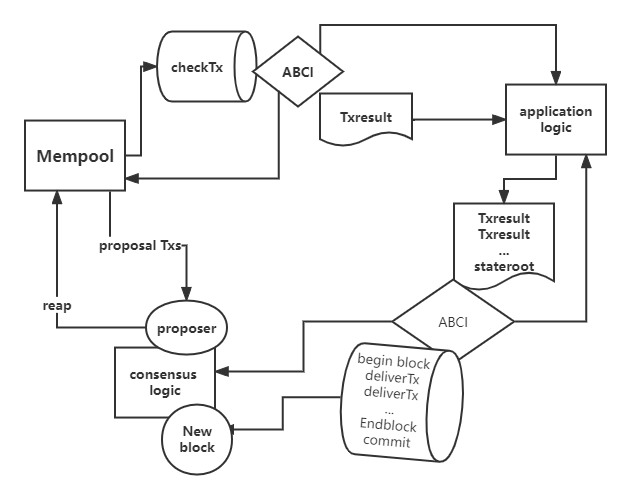

# 网络共识

## 介绍
xchain改进了主流的联盟链共识算法，采用POA+PBFT和POA+Raft两种共识。
整个过程包括2大阶段：  

1.验证人轮值：验证人集合按照约定的选举规则选举出负责出块的节点  
2.出块：通过出块规则进行出块

**验证者validator**

验证者负责在区块链中提交新块。这些验证者通过广播 *votes* 参与共识协议，其中包含由每个验证者的私钥签名的加密签名。
验证者在共识协议中可能具有不同的投票“权重”。xchain并不关注验证者数目的三分之一或三分之二， 而是关注总投票权的比例。而且，这个比例可能不是在各个验证者中均匀分布的。

**如何创建验证者**

有两种方法可以成为验证者。

1.  创世区块创立时预见建立
1.  ABCI 应用程序通过更改现有验证者集来响应 EndBlock 消息(可新增、可删除、可修改权重)

**内存池Mempool**

每个节点维护自己的内存池,内存池中存放着暂未出块的交易。节点当交易进入自己的menpool就会广播同步给其他节点。

##  POA+PBFT

**共识逻辑**

validator轮流提出区块并对其进行投票。 

在链中提交的每一个区块都有一个**height（高度）** 。 

当一个区块提交失败时，协议将进入到下一**round（轮）** ，新的验证者将为该高度提出一个新的区块。 

成功提交一个块需要两个阶段的投票，分别是**pre-vote（预投票）** 和**pre-commit（预提交)** 。 当超过2/3的验证者在同一轮中预提交同一个区块时，区块就会被提交到区块链中。

> 验证者可能由于多种原因未能提交区块： 当前的区块提交者可能离线，或者网络可能拥堵。就会确认跳过这个验证者。在投票进入下一轮之前，验证者们会等待一小段时间从提交者处收到完整的区块。

**交易流程图**

  

  
 
**交易的处理逻辑**

>区块的执行逻辑
>
>beginBlock 
>
>deliverTxs 
>
>  ...
>  
>endBlock 
>
>commit

**验证节点间轮值**

poa+pbft的出块节点有一个固定的顺序，验证节点会一直检查是否轮到自己出块了。

## POA+RAFT

**交易流程**

leader选举出来后，所有日志都必须首先提交至 leader 节点，leader 将此条目复制给所有的节点。

当大多数节点记录此条目之后，leader 节点认定此条目有效，将此条目设定为已提交并存储于本地磁盘。

leader 通知所有节点提交这一日志条目并存储于各自的磁盘内。

**验证节点间轮值**

leader节点会一直向其他节点发送“心跳”，表明自己还在任期

当节点没有收到leader的心跳时 : 采取验证人节点间竞争的方式

每个validator发起选举然后投票给自己，并向集群其他服务器验证人发送投票请求。有超过1/2的验证人返回同一个leader后确认

当leader超时或不在线时，重新选举leader

