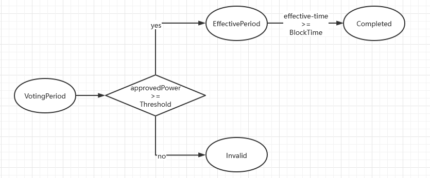

# 网络治理
## 提案
雄安链中的提案交易由网络管理员发起，每一个提案都会对应一个模块 `pending` 状态的 `msg` , 提案投票结束后该 `msg` 生效或者回滚。

提案刚创建时的状态为`VotingPeriod` 投票阶段,在此阶段网络管理员可以对该提案进行投票，在投票期未结束时若已收集到足够的赞成票提案会提前进入 `EffectivePeriod` 待生效阶段，待生效阶段提案不再接受投
票，待提案生效时间到达后提案即生效状态变更为 `Completed`。提案投票阶段结束后若未收集到足够的赞成票提案状态变更为 `Invalid`。



提案的生效期和投票期对应的提案发起时的 `effective-time` , `vote-end-time` 参数，`effective-time` 必须大于或等于 `vote-end-time`。

发起一个添加网络管理员的提案
```shell script
发起提案 提案生效时间为120s后 投票期截止到120s后
> xccli tx member addNwAdmin xchain190tln4x9nutllxfdnvqtne7f0sy7d2vfd09yfj 100 --effective-time $(($(date +%s) + 120))  --vote-end-time $(($(date +%s) + 120)) --from jack -y
{
  "height": "0",
  "txhash": "89E2E8341C3CED4B76E13D9C8DD0319992132169C0EBB5EDC8955F75F7E1515E"
}

找到提案id
> xccli query tx 89E2E8341C3CED4B76E13D9C8DD0319992132169C0EBB5EDC8955F75F7E1515E | jq .logs[0].events[1].attributes[3].value
member_xchain152pks72p3awfvpthfsw2ejl25m05hhgm9khgdg_1658384440

查看提案
> xccli query gov proposal member_xchain152pks72p3awfvpthfsw2ejl25m05hhgm9khgdg_1658384440
{
  "proposer": "xchain152pks72p3awfvpthfsw2ejl25m05hhgm9khgdg",
  "proposal_id": "member_xchain152pks72p3awfvpthfsw2ejl25m05hhgm9khgdg_1658384440",
  "router_key": "member",
  "op_type": "add_nwadmin",
  "content": "{\"type\":\"xchain/ExtensionAddNwAdmin\",\"value\":{\"address\":\"xchain190tln4x9nutllxfdnvqtne7f0sy7d2vfd09yfj\",\"power\":\"100\",\"effective_time\":\"1658384562\",\"vote_end_time\":\"1658384562\",\"owner\":\"xchain152pks72p3awfvpthfsw2ejl25m05hhgm9khgdg\",\"org_id\":\"NetworkOrg\"}}",
  "admins": [
    {
      "address": "xchain10w9n88qwz2vnguxhv0qv7unzz8lev8rc680aze",
      "power": "100"
    },
    {
      "address": "xchain152pks72p3awfvpthfsw2ejl25m05hhgm9khgdg",
      "power": "100"
    }
  ],
  "approved_admins": null,
  "refused_admins": null,
  "abstained_admins": null,
  "create_time": "2022-07-21T06:20:40.317565572Z",
  "effective_time": "1658384562",
  "vote_end_time": "1658384562",
  "proposal_status": "VotingPeriod",
  "propose_level": "0"
}

```
## 投票

雄安链提供了两种投票阈值计算方式，所有票模式`approvedPower/allPower` 和参与票模式 `approvedPower/votePower`。在所有票模式中阈值的计算方式为赞成票权重占所有票权重的比重，在参与票模式中
阈值的计算方式为赞成票权重占参与这次投票的权重的比重。

假设当前有一个提案，当前网络管理员的总权重为100，在这次投票中共收集到了30权重的赞成票，10权重的反对票和10权重的弃权票，所有票模式计算的阈值为 `30 / 100 = 30%`, 
参与票模式计算的阈值为 `30 /（30 + 10 + 10）= 60%` ,雄安链设置的投票阈值缺省值为50%，则在这个缺省阈值下所有票模式该提案无效，参与票模式该提案生效。

- 查看投票参数:
```shell script
> xccli query manage voteParameter
{
  "effective_threshold": "50",
  "take_effect_threshold": "50",
  "counting_votes": false
}
注: 这里50的意思为 大于等于50% 即通过
    counting_votes true: 所有票模式
                   false: 参与票模式
```

网络管理员在提案的`VotingPeriod` 阶段对提案进行投票，投票类型分为:
  1. 赞成 `0` 
  2. 反对 `1`
  3. 弃权 `2`

- 对上面的提案进行投票
```shell script
投票
> xccli tx gov vote member_xchain152pks72p3awfvpthfsw2ejl25m05hhgm9khgdg_1658384440 0 --from jack -y
{
  "height": "0",
  "txhash": "512138A0C90C388F3DE91A59E2A090C3513DBA13269D74B2B429154593ADC51D"
}

查看提案
> xccli query gov proposal member_xchain152pks72p3awfvpthfsw2ejl25m05hhgm9khgdg_1658384440
{
  "proposer": "xchain152pks72p3awfvpthfsw2ejl25m05hhgm9khgdg",
  "proposal_id": "member_xchain152pks72p3awfvpthfsw2ejl25m05hhgm9khgdg_1658384440",
  "router_key": "member",
  "op_type": "add_nwadmin",
  "content": "{\"type\":\"xchain/ExtensionAddNwAdmin\",\"value\":{\"address\":\"xchain190tln4x9nutllxfdnvqtne7f0sy7d2vfd09yfj\",\"power\":\"100\",\"effective_time\":\"1658384562\",\"vote_end_time\":\"1658384562\",\"owner\":\"xchain152pks72p3awfvpthfsw2ejl25m05hhgm9khgdg\",\"org_id\":\"NetworkOrg\"}}",
  "admins": [
    {
      "address": "xchain10w9n88qwz2vnguxhv0qv7unzz8lev8rc680aze",
      "power": "100"
    },
    {
      "address": "xchain152pks72p3awfvpthfsw2ejl25m05hhgm9khgdg",
      "power": "100"
    }
  ],
  "approved_admins": [
    {
      "proposal_id": "member_xchain152pks72p3awfvpthfsw2ejl25m05hhgm9khgdg_1658384440",
      "voter_address": "xchain152pks72p3awfvpthfsw2ejl25m05hhgm9khgdg",
      "power": "100",
      "vote_type": "0",
      "vote_time": "2022-07-21T06:21:45.550851815Z"
    }
  ],
  "refused_admins": null,
  "abstained_admins": null,
  "create_time": "2022-07-21T06:20:40.317565572Z",
  "effective_time": "1658384562",
  "vote_end_time": "1658384562",
  "proposal_status": "EffectivePeriod",
  "propose_level": "0"
}

```

- 查看投票信息
```shell script
> xccli query gov vote  --proposalId member_xchain152pks72p3awfvpthfsw2ejl25m05hhgm9khgdg_1658384440 --owner-address xchain152pks72p3awfvpthfsw2ejl25m05hhgm9khgdg
{
  "proposal_id": "member_xchain152pks72p3awfvpthfsw2ejl25m05hhgm9khgdg_1658384440",
  "voter_address": "xchain152pks72p3awfvpthfsw2ejl25m05hhgm9khgdg",
  "power": "100",
  "vote_type": "0",
  "vote_time": "2022-07-21T06:21:45.550851815Z"
}
```
## 治理

雄安链中会发起提案的交易类型：
- member模块
  - AddOrg
  - RevokeOrg
  - FreezeOrg
  - UnfreezeOrg
  - AddNwAdmin
  - RevokeNwAdmin
  - AddGateway
  - RevokeGateway
  - SavePermission
  - ChangeOrgAdmin(部分：切换一级组织的组织管理员)
  - FreezeAccount(部分：网络管理组的所有成员或者一级组织管理员)
  - UnfreezeAccount(部分：网络管理组的所有成员或者一级组织管理员)
- poa模块
  - CreateValidator
  - EditValidator
- params模块
  - ParamChange
- upgrade模块
  - Upgrade
- manage模块
  - UpdateVoteParameter